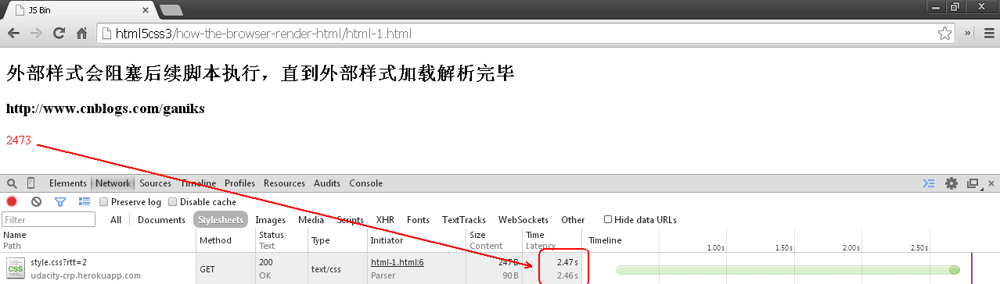
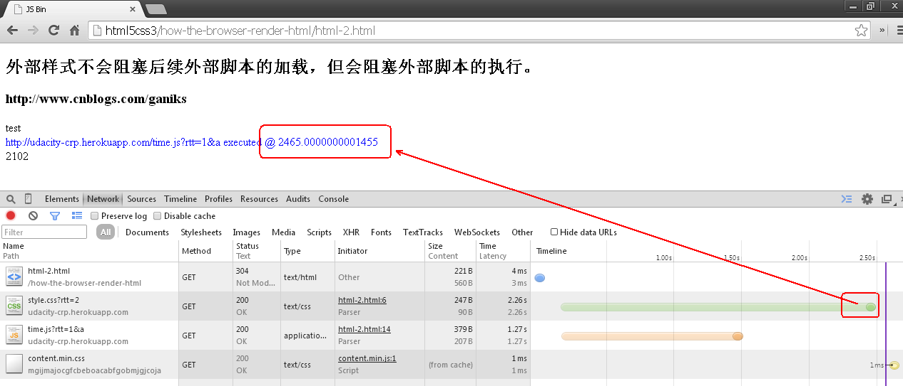
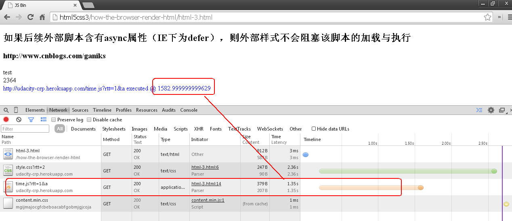
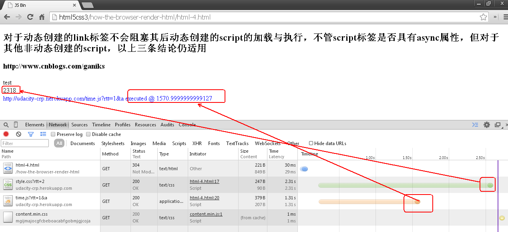

输入完网址按下回车，到看到网页这个过程中发生了什么
===

+ 解析HTML & 构建DOM树
+ DOM树与CSS样式进行附着构造呈现树
+ 布局
+ 绘制

解析HTML & 构建DOM树
---

    在这里我们讨论两种DOM元素的解析，即样式（link、style）与脚本文件（script）。由于浏览器采用自上而下的方式解析，在遇到这两种元素时都会阻塞浏览器的解析，直到外部资源加载并解析或执行完毕后才会继续向下解析html。
	对于样式与脚本的先后顺序同样也会影响到浏览器的解析过程，究其原因主要在于：script脚本执行过程中可能会修改html界面（如document.write函数）；DOM节点的CSS样式会影响js的执行结果。

###html-1.html

###html-2.html

###html-3.html

###html-4.html

> html解析完毕，DOM树创建完成后DOMContentLoaded事件即触发，这时候可以用过script来操作DOM节点。

DOM树与CSS样式进行附着构造呈现树
---
HTML解析完毕后，开始构建呈现树RenderTree，这一步的主要工作在于将css样式应用到DOM节点上，WebKit内核将这一过程称为附着，其他浏览器有不同的概念。对前端工程师而言这个过程会涉及到CSS层叠问题。

　　首先将根据样式重要性排序，由低到高依次为：

浏览器声明
用户普通声明
作者普通声明
作者重要声明
用户重要声明
　　对于同一重要级别，则是根据CSS选择符的特指度来判定优先级；一条样式声明的特指度由以下四个部分决定：S-I-C-E

声明来自内联的style属性则 S+1；
声明中含有id属性则 I+1；
声明中含有类、伪类、属性选择器则 C+1；
生命中含有元素、伪元素选择器则 E+1；
　　特指度的比较类似于两个字符串之间比较大小。

　　呈现树的每一个节点即为与其相对应的DOM节点的CSS框，框的类型与DOM节点的display属性有关，block元素生成block框，inline元素生成inline框。每一个呈现树节点都有与之相对应的DOM节点，但DOM节点不一定有与之相对应的呈现树节点，比如display属性为none的DOM节点，而且呈现树节点在呈现树中的位置与他们在DOM树中的位置不一定相同，比如float与绝对定位元素。

　　下图为呈现树与其相对应的DOM树节点

布局
---
　　呈现树构造完成后浏览器便进行布局处理，及计算每个呈现树节点的大小和位置信息。有道友可能要问，前面已将样式附着到DOM节点上，不是已经有了样式信息为何还要计算大小。这里可以这样理解，以上包含大小的样式信息只是存在内存里，并没有实际使用，浏览器要根据窗口的实际大小来处理呈现树节点的实际显示大小和位置，比如对于margin为auto的处理。

　　布局是一个递归过程，从跟呈现节点开始，递归遍历子节点，计算集合几何信息。具体过程还是比较复杂偶也不甚了解，道友们还是查阅其他资料吧。

绘制
---
  布局完成后，便是将呈现树绘制出来显示在屏幕上。对于每一个呈现树节点来说，主要绘制顺序如下：

背景颜色
背景图片
边框
子呈现树节点
轮廓
